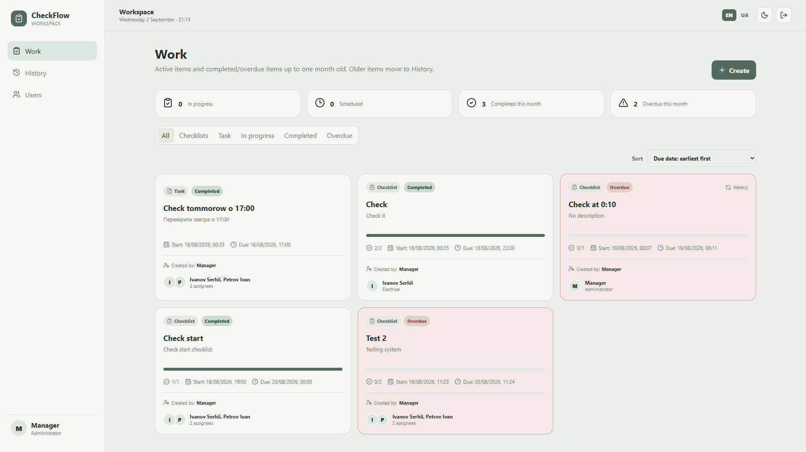

<p align="center">
  
</p>

<h1 align="center">CheckFlow</h1>



## Features

-   Tasks and multi-item checklists
-   Start dates and deadlines with date and time
-   Multiple assignees
-   Employee, Manager and Administrator roles
-   Checklist item completion with reasons when an item cannot be
    completed
-   Optional photo confirmation for checklist items
-   Comments
-   Deadline extension requests and approval workflow
-   Completed and overdue work history
-   Sorting and filtering
-   Responsive desktop, tablet and mobile interface
-   Light and dark themes
-   English and Ukrainian interface
-   Optional Telegram notifications

## User Management

Administrators can create and manage users. Users can have a name,
username, position, role, password and Telegram Chat ID.

Available roles:

-   **Employee** --- works with assigned tasks and checklists.
-   **Manager** --- creates and manages work, assigns employees and
    reviews extension requests.
-   **Administrator** --- full access including user management.

Administrators can edit users, change roles and positions, reset
passwords, block/unblock users and delete users.

## Telegram Notifications

Create a Telegram bot using **BotFather** and obtain its bot token.

Create a `.env` file next to `docker-compose.yml`:

``` env
TELEGRAM_BOT_TOKEN=YOUR_TELEGRAM_BOT_TOKEN
```

Configure the Telegram Chat ID for each employee in CheckFlow.

> Never commit the `.env` file or Telegram bot token to a public
> repository.

Add it to `.gitignore`:

``` gitignore
.env
```

## Languages

-   🇬🇧 English --- default
-   🇺🇦 Ukrainian

The selected language is remembered by the browser between sessions.

## Installation

### Requirements

Docker and Docker Compose:

``` bash
docker --version
docker compose version
```

### Download

``` bash
git clone https://github.com/RyVolodya/checkflow.git
cd checkflow
```

Alternatively, download the repository as a ZIP archive and extract it.

### Start

``` bash
docker compose up -d --build
```

Check the containers:

``` bash
docker compose ps
```

Backend logs:

``` bash
docker compose logs -f backend
```

### Open CheckFlow

``` text
http://SERVER-IP:8088
```

Example:

``` text
http://192.168.1.100:8088
```

## Default Login

``` text
Username: Manager
Password: manager
```

After the first login, CheckFlow requires the default password to be
changed.

> Do not continue using the default password in a production
> environment.

Do **not** use `docker compose down -v` unless you intentionally want to
remove the database volume and its data.

## Technology Stack

-   React
-   TypeScript
-   Vite
-   Node.js
-   Express
-   Prisma
-   PostgreSQL
-   Nginx
-   Docker Compose

## Data Storage

Application data is stored in PostgreSQL using a persistent Docker
volume. Uploaded checklist photos are stored persistently as well.

Rebuilding the containers does not remove persistent data.

## Project Status

CheckFlow is under active development and is evolving into a self-hosted
workspace for managing tasks, recurring processes, employee assignments,
deadlines, notifications and work history.

------------------------------------------------------------------------

